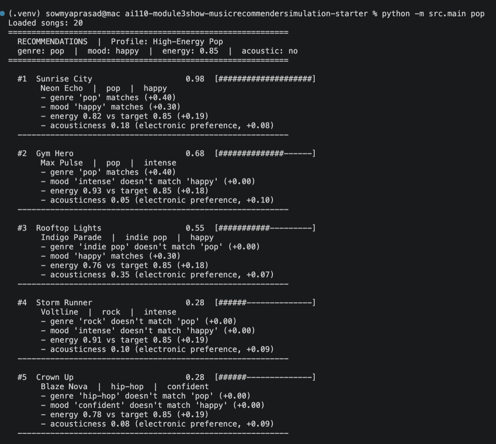
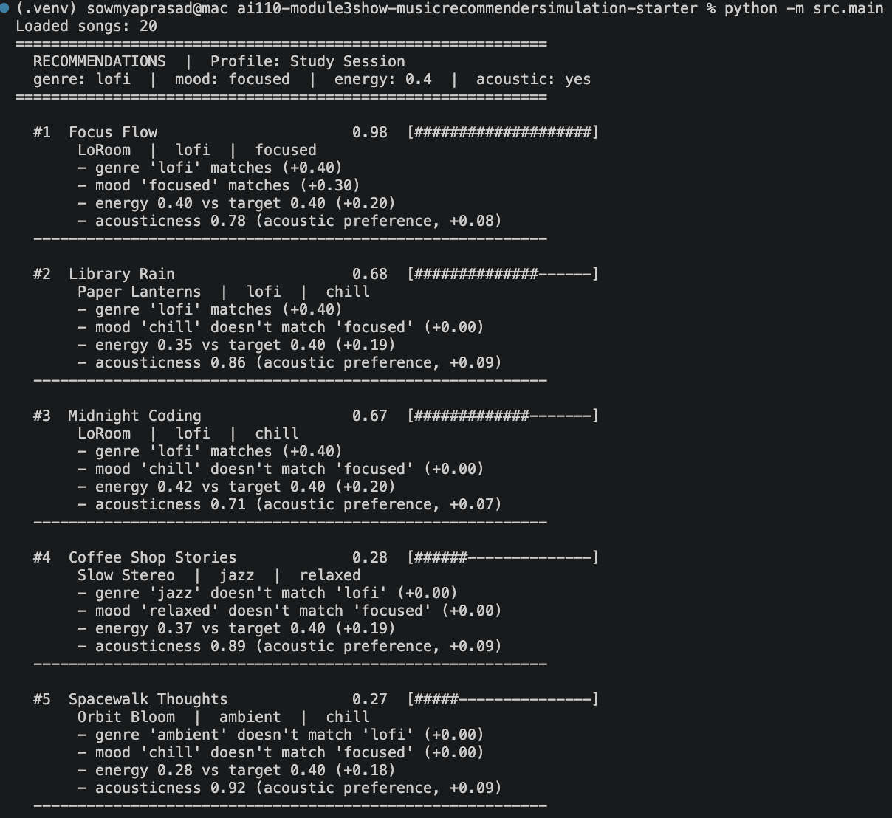
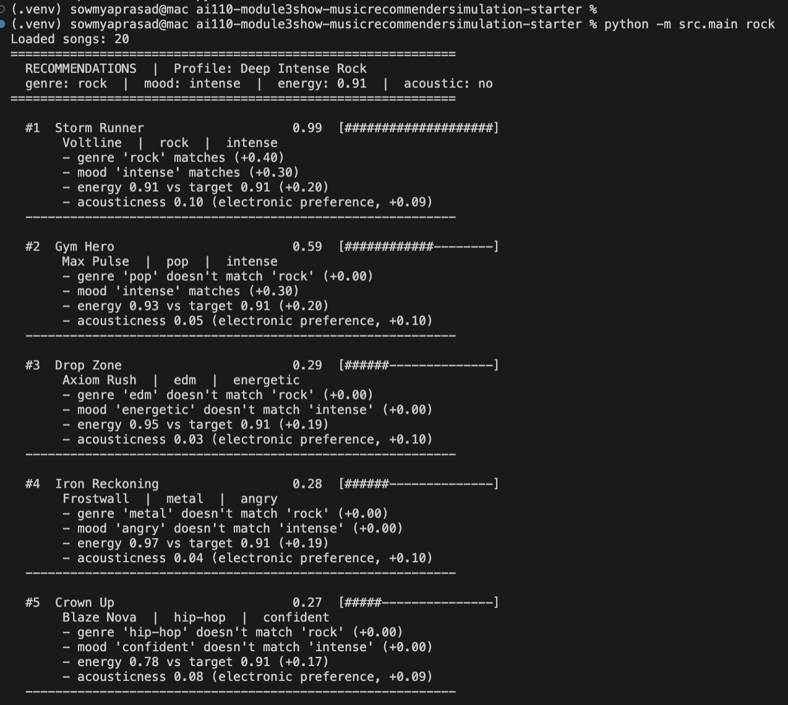

# 🎵 Music Recommender Simulation

## Project Summary

In this project you will build and explain a small music recommender system.

Your goal is to:

- Represent songs and a user "taste profile" as data
- Design a scoring rule that turns that data into recommendations
- Evaluate what your system gets right and wrong
- Reflect on how this mirrors real world AI recommenders

Real-world recommenders like Spotify or YouTube use two main strategies: collaborative filtering (users who liked X also liked Y, so recommend Y) and content-based filtering (X has these audio properties, here are songs with similar properties). Most production systems combine both. This version is purely content-based. It stores a user preference profile with a target genre, mood, energy level, and valence. For each song in the catalog, it computes a score based on how well the song matches those preferences. Categorical features like genre and mood are checked for exact matches and given higher weight. Numerical features like energy and valence are scored by proximity. a song with energy 0.41 scores higher than one with 0.91 for a user who wants 0.40, not because low is better, but because closer is better. The top-scoring songs are returned as recommendations.

---

## How The System Works

### Song features

Each `Song` stores 10 fields loaded from `data/songs.csv`:

| Field | Type | What it captures |
|---|---|---|
| `genre` | string | Musical category (pop, lofi, rock, jazz, etc.) |
| `mood` | string | Listening context (happy, chill, intense, focused, etc.) |
| `energy` | float 0–1 | Intensity — 0.28 is ambient calm, 0.93 is gym-level loud |
| `valence` | float 0–1 | Positivity — high values are upbeat, low values are darker |
| `danceability` | float 0–1 | Rhythmic drive and beat strength |
| `acousticness` | float 0–1 | How acoustic vs. electronic the song sounds |
| `tempo_bpm` | float | Beats per minute |

`id`, `title`, and `artist` are also stored but not used in scoring.

### User profile

`UserProfile` stores four preference fields:

- `favorite_genre` — the genre to prioritize (e.g. `"lofi"`)
- `favorite_mood` — the mood to prioritize (e.g. `"chill"`)
- `target_energy` — a 0–1 float for how intense the user wants songs to feel
- `likes_acoustic` — boolean; boosts songs with high acousticness when `True`

### Algorithm Recipe

**Step 1 — Load the catalog**
Read `data/songs.csv` into a list of song dictionaries. Each row becomes one candidate.

**Step 2 — Receive a user profile**
Accept a `user_prefs` dictionary with five keys:
`genre`, `mood`, `target_energy`, `target_valence`, `likes_acoustic`.

**Step 3 — Score every song**
For each song, call `score_song(user_prefs, song)` which computes:

```
score = (0.40 × genre_match)
      + (0.30 × mood_match)
      + (0.20 × (1 − |song.energy − user.target_energy|))
      + (0.10 × acousticness_bonus)
```

Where:
- `genre_match` = 1 if `song.genre == user.genre`, else 0
- `mood_match` = 1 if `song.mood == user.mood`, else 0
- Energy uses **proximity scoring** — score is 1.0 on exact match, decreases as the gap grows in either direction; a song is not rewarded for being high or low, only for being *close*
- `acousticness_bonus` = `song.acousticness` if `likes_acoustic` is `True`, else `1 − song.acousticness`

Maximum possible score is 1.0. The function also returns a list of human-readable reason strings explaining which terms contributed.

**Step 4 — Rank and return**
Sort all scored songs by score descending. Return the top `k` (default 5).

### Sample output

Each profile can be run individually:

```bash
python -m src.main pop    # High-Energy Pop
python -m src.main lofi   # Chill Lofi
python -m src.main rock   # Deep Intense Rock
python -m src.main        # all three in sequence
```

**High-Energy Pop** — genre: pop | mood: happy | energy: 0.85 | acoustic: no



---

**Chill Lofi** — genre: lofi | mood: chill | energy: 0.38 | acoustic: yes



---

**Deep Intense Rock** — genre: rock | mood: intense | energy: 0.91 | acoustic: no



---

### Known biases and limitations

| Bias | Why it happens | Effect |
|---|---|---|
| Genre dominance | Genre carries 40% of the score — the single largest weight | A perfect genre match with wrong mood (0.40) outscores a wrong genre with perfect mood + energy + acousticness (0.60 max). Great songs in adjacent genres get buried. |
| Mood binary penalty | Mood is exact-match only — "chill" and "relaxed" score identically to "chill" vs "metal" | Semantically similar moods are treated as total misses, which is wrong |
| Valence not scored | `target_valence` is in the profile but the current formula does not use it | A user who wants dark/low-valence songs will still receive upbeat songs if the genre and mood match |
| No diversity enforcement | The ranker returns the top k by score with no diversity check | If 4 lofi songs all score 0.90, the top 5 will be nearly identical — no variety |
| Catalog size | 20 songs total | For profiles targeting underrepresented genres (e.g. classical, reggae), there is only one matching song — recommendations are thin by default |

---

## Getting Started

### Setup

1. Create a virtual environment (optional but recommended):

   ```bash
   python -m venv .venv
   source .venv/bin/activate      # Mac or Linux
   .venv\Scripts\activate         # Windows

2. Install dependencies

```bash
pip install -r requirements.txt
```

3. Run the app:

```bash
python -m src.main
```

### Running Tests

Run the starter tests with:

```bash
pytest
```

You can add more tests in `tests/test_recommender.py`.

---

## Experiments You Tried

Use this section to document the experiments you ran. For example:

- What happened when you changed the weight on genre from 2.0 to 0.5
- What happened when you added tempo or valence to the score
- How did your system behave for different types of users

---

## Limitations and Risks

Summarize some limitations of your recommender.

Examples:

- It only works on a tiny catalog
- It does not understand lyrics or language
- It might over favor one genre or mood

You will go deeper on this in your model card.

---

## Reflection

Read and complete `model_card.md`:

[**Model Card**](model_card.md)

Write 1 to 2 paragraphs here about what you learned:

- about how recommenders turn data into predictions
- about where bias or unfairness could show up in systems like this


---

## 7. `model_card_template.md`

Combines reflection and model card framing from the Module 3 guidance. :contentReference[oaicite:2]{index=2}  

```markdown
# 🎧 Model Card - Music Recommender Simulation

## 1. Model Name

Give your recommender a name, for example:

> VibeMatch 1.0

---

## 2. Intended Use

- What is this system trying to do
- Who is it for

Example:

> This model suggests 3 to 5 songs from a small catalog based on a user's preferred genre, mood, and energy level. It is for classroom exploration only, not for real users.

---

## 3. How It Works (Short Explanation)

Describe your scoring logic in plain language.

- What features of each song does it consider
- What information about the user does it use
- How does it turn those into a number

Try to avoid code in this section, treat it like an explanation to a non programmer.

---

## 4. Data

Describe your dataset.

- How many songs are in `data/songs.csv`
- Did you add or remove any songs
- What kinds of genres or moods are represented
- Whose taste does this data mostly reflect

---

## 5. Strengths

Where does your recommender work well

You can think about:
- Situations where the top results "felt right"
- Particular user profiles it served well
- Simplicity or transparency benefits

---

## 6. Limitations and Bias

Where does your recommender struggle

Some prompts:
- Does it ignore some genres or moods
- Does it treat all users as if they have the same taste shape
- Is it biased toward high energy or one genre by default
- How could this be unfair if used in a real product

---

## 7. Evaluation

How did you check your system

Examples:
- You tried multiple user profiles and wrote down whether the results matched your expectations
- You compared your simulation to what a real app like Spotify or YouTube tends to recommend
- You wrote tests for your scoring logic

You do not need a numeric metric, but if you used one, explain what it measures.

---

## 8. Future Work

If you had more time, how would you improve this recommender

Examples:

- Add support for multiple users and "group vibe" recommendations
- Balance diversity of songs instead of always picking the closest match
- Use more features, like tempo ranges or lyric themes

---

## 9. Personal Reflection

A few sentences about what you learned:

- What surprised you about how your system behaved
- How did building this change how you think about real music recommenders
- Where do you think human judgment still matters, even if the model seems "smart"

